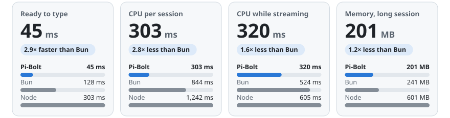
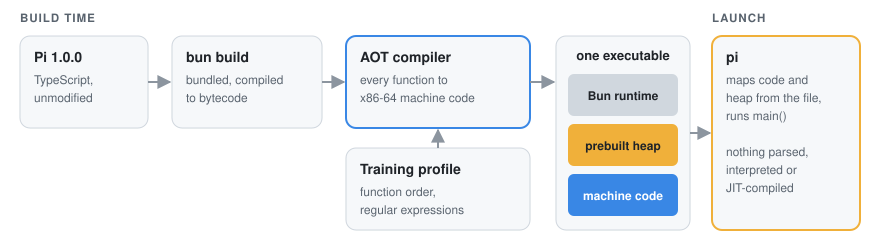

<p align="center">
  <a href="https://github.com/opensec-git/Pi-Bolt">
    
  </a>
</p>
<p align="center">
  <a href="https://github.com/opensec-git/Pi-Bolt/releases/latest"></a>
  <a href="https://github.com/earendil-works/pi/releases/tag/v1.0.0"></a>
  <a href="#requirements"></a>
  <a href="LICENSE"></a>
</p>

> Pi-Bolt is an independent project, not affiliated with Pi's authors or with Oven. For Pi itself, see
> [earendil-works/pi](https://github.com/earendil-works/pi).

# Pi-Bolt

Pi-Bolt is the [Pi](https://github.com/earendil-works/pi) coding agent compiled ahead of time to native code. It is one Linux
executable, ready in 83 ms, using half the CPU of Pi on Bun, with no JIT.

It runs the Pi you already use: the commands, keys, sessions, settings, extensions and providers are all Pi's. What differs is
how Pi is executed. Every function is compiled to x86-64 machine code when the executable is built, and stored in it together
with a prebuilt JavaScript heap, so at launch nothing is parsed, interpreted or JIT-compiled.

* **[Getting started](#getting-started)**: install a release; there is nothing to compile
* **[Benchmarks](docs/BENCHMARKS.md)**: Pi-Bolt vs Pi on Bun and on Node, with method and raw data
* **[Plugins](docs/PLUGINS.md)**: compile your Pi extensions in, and they run as machine code too

<picture>
  <source media="(prefers-color-scheme: dark)" srcset="docs/images/bench-hero-dark.svg">
  
</picture>

## Getting started

Install the latest release:

```bash
curl -fsSL https://raw.githubusercontent.com/opensec-git/Pi-Bolt/main/install.sh | bash
```

The installer:

- picks the build for your CPU;
- checks its SHA-256 checksum;
- installs it to `~/.pi-bolt`;
- links the `pi-bolt` command into `~/.local/bin`.

Start it where you want it to work:

```bash
cd /path/to/project
pi-bolt
```

Pi-Bolt shares your Pi configuration in `~/.pi/agent`, so your providers, settings and sessions are already there. If you are
new to Pi, run `/login` inside it to connect a provider, then give it a task. To use it as your `pi`, add `alias pi=pi-bolt` to
your shell profile. Everything in [Pi's documentation](https://github.com/earendil-works/pi/tree/main/packages/coding-agent/docs)
applies.

You can also download a build from the [latest release](https://github.com/opensec-git/Pi-Bolt/releases/latest), check it
against `SHA256SUMS`, unpack it, and run `./pi` in the unpacked folder:

| Download | For |
|---|---|
| `pi-bolt-linux-x64.tar.gz` | **Recommended.** CPUs with AVX2: Intel Haswell (2013) and later, AMD Zen and later |
| `pi-bolt-linux-x64-baseline.tar.gz` | Any x86-64 CPU |
| `pi-bolt-linux-x64-jit.tar.gz` | Also JIT-compiles code loaded at run time, for heavy use of run-time plugins |
| `pi-bolt-runtime-linux-x64.tar.gz` | The Pi-Bolt Bun runtime, to [compile plugins in](docs/PLUGINS.md) without building it |

### Requirements

- Linux on x86-64 with glibc 2.17 or later. Tested on Ubuntu 20.04, 22.04 and 24.04, Debian 11 and 12, Rocky Linux 8 and 9,
  CentOS 7 and Amazon Linux 2. musl-based distributions such as Alpine are not supported.
- macOS, Windows and ARM64 builds are not available yet.

## Benchmarks

<picture>
  <source media="(prefers-color-scheme: dark)" srcset="docs/images/bench-speed-dark.svg">
  
</picture>

<picture>
  <source media="(prefers-color-scheme: dark)" srcset="docs/images/bench-cpu-dark.svg">
  
</picture>

<picture>
  <source media="(prefers-color-scheme: dark)" srcset="docs/images/bench-memory-dark.svg">
  
</picture>

These are Pi 1.0.0 on an AMD EPYC 7B13, pinned to 8 cores. Each scenario runs fresh processes, interleaved across runtimes,
against a local model server that streams a scripted conversation. The figures therefore measure Pi and its runtime, not the
network or a model. Bun 1.4.2 runs Pi built with Pi's own `bun build --compile` command plus `--bytecode`, which makes stock Bun
faster. Node 22 runs Pi's npm package.

[docs/BENCHMARKS.md](docs/BENCHMARKS.md) has every figure, the method, and the raw data. It also answers
[why run-time plugins are slow on the default build](docs/BENCHMARKS.md#why-is-a-run-time-plugins-loop-1080-ms-on-pi-bolt-and-38-ms-on-bun)
and [how the streaming CPU gap was closed](docs/BENCHMARKS.md#how-was-the-streaming-gap-closed). To reproduce everything, run
[`bench/run-suite.sh`](bench/run-suite.sh).

## Plugins

Pi extensions work in Pi-Bolt unchanged: in `~/.pi/agent/extensions`, in a project's `.pi/extensions`, or as Pi packages. For
the ones you use every day, compile them into the executable:

```bash
scripts/build-pi.sh --plugins my-plugins/plugins.ts --out out/pi-bolt-plugins
```

<picture>
  <source media="(prefers-color-scheme: dark)" srcset="docs/images/bench-plugins-dark.svg">
  
</picture>

The default build has no JIT. A plugin loaded at run time is therefore interpreted, and a plugin compiled in runs as machine code.
[docs/PLUGINS.md](docs/PLUGINS.md) covers porting, compatibility, and writing plugin code the compiler handles well.

## How it works

<picture>
  <source media="(prefers-color-scheme: dark)" srcset="docs/images/how-it-works-dark.svg">
  
</picture>

1. **Bun bundles Pi** and compiles it to JavaScriptCore bytecode.
2. **The ahead-of-time compiler** turns every function into optimized x86-64 machine code, through B3, the back end of
   JavaScriptCore's top-tier JIT. It infers types from the program, guards its assumptions, and keeps generic paths for what it
   cannot prove.
3. **The prebuilt heap** is Pi's modules, already loaded and evaluated. It is stored in the executable and mapped at launch.
4. **A training profile**, recorded once per Pi version, orders the code so that startup touches as few pages as possible.

The compiler comes from [oven-sh/WebKit#743](https://github.com/oven-sh/WebKit/pull/743), which targets ARM64. Pi-Bolt ports it
to x86-64 and adds its own code-generation and runtime work. See [docs/ARCHITECTURE.md](docs/ARCHITECTURE.md).

## Documentation

| | |
|---|---|
| [Architecture](docs/ARCHITECTURE.md) | What the executable contains, how it is built, what happens at launch |
| [Building](docs/BUILDING.md) | Building the runtime and Pi from source, training profiles, tests |
| [Benchmarks](docs/BENCHMARKS.md) | Method, results, raw data, and questions |
| [Plugins](docs/PLUGINS.md) | Porting Pi extensions, compatibility, writing them for AOT |
| [Troubleshooting](docs/TROUBLESHOOTING.md) | Diagnostics, environment variables, known limitations |

## Development

Build everything from source:

```bash
git clone https://github.com/opensec-git/Pi-Bolt.git
cd Pi-Bolt
scripts/fetch-sources.sh            # WebKit and Bun at the pinned commits, with Pi-Bolt's patches
scripts/toolchain/make-sysroot.sh   # glibc 2.17 sysroot with static ICU, for portable executables
scripts/build-runtime.sh            # the Pi-Bolt Bun runtime
scripts/fetch-pi.sh                 # Pi 1.0.0, built
scripts/build-pi.sh                 # out/pi-bolt/pi
```

To skip building the runtime, run `scripts/fetch-runtime.sh` instead of the first three commands. It downloads the released
runtime, and building Pi then takes about a minute.

Before submitting changes, run:

```bash
tests/aot/run.sh                                                        # engine tests
python3 bench/e2e_tools.py --reference bun=out/pi-stable/pi --build pi-bolt=out/pi-bolt/pi
python3 bench/ui_check.py --project .work/pi --build pi-bolt=out/pi-bolt/pi
```

[docs/BUILDING.md](docs/BUILDING.md) has the requirements, every option, and how to regenerate the patches.

```
patches/      Pi-Bolt's changes to WebKit (JavaScriptCore) and Bun, against the commits in sources.json
scripts/      fetch, build, train and package
profiles/     training profiles per Pi version
examples/     an example plugin
bench/        benchmarks, end-to-end checks, the scripted model server, and published results
tests/aot/    engine correctness tests
docs/         documentation and images
```

## Contributing

See [CONTRIBUTING.md](CONTRIBUTING.md). Report security issues privately, as described in [SECURITY.md](SECURITY.md).

## License

MIT. The release executables include third-party software under its own licenses: Bun (MIT), JavaScriptCore (LGPL-2.0 and
BSD), ICU (Unicode License) and Pi (MIT). See [THIRD_PARTY_NOTICES.md](THIRD_PARTY_NOTICES.md).

<p align="center">
  Built on <a href="https://github.com/earendil-works/pi">Pi</a> by Mario Zechner and contributors,
  and <a href="https://github.com/oven-sh/bun">Bun</a> by Oven.
</p>
