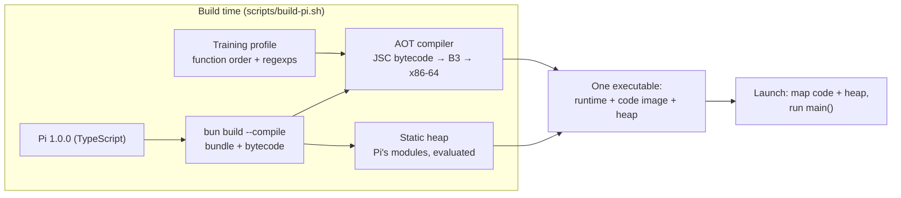

<div align="center">

# Pi-Bolt

**The [Pi coding agent](https://github.com/earendil-works/pi), compiled ahead of time to native code.**

One self-contained Linux executable. It is ready in 77 ms and uses less than half the CPU of Pi on stock Bun, without a JIT.

[](https://github.com/opensec-git/Pi-Bolt/releases/latest)
[](#requirements)
[](https://github.com/earendil-works/pi/releases/tag/v1.0.0)
[](LICENSE)

[Install](#install) · [Benchmarks](#benchmarks) · [Plugins](#plugins) · [How it works](#how-it-works) · [Build from source](#build-from-source) · [Docs](docs)

</div>

---

Pi-Bolt runs the same Pi you already use. The commands, keys, sessions, settings, extensions and providers are all Pi's. What
differs is how the program is executed. Every function of Pi is compiled to x86-64 machine code at build time and stored in the
executable, together with a prebuilt JavaScript heap. At launch nothing is parsed, interpreted or JIT-compiled: the code and heap
are mapped from the executable, and Pi is ready to run.

|  | Pi-Bolt | Pi on Bun 1.4.2 | Pi on Node 22 |
|---|---:|---:|---:|
| Interactive launch, ready to type | **77 ms** | 123 ms | 305 ms |
| CPU for a 5-prompt session (25 model turns) | **378 ms** | 827 ms | 1,235 ms |
| `pi -p` one prompt, 5 model turns | **112 ms** | 164 ms | 406 ms |
| Per prompt late in a 2.7M-token session | **154 ms** | 232 ms | 249 ms |
| Memory of its own in a tmux session | **35 MB** | 94 MB | 130 MB |

<sub>Pi 1.0.0 on an AMD EPYC 7B13, 8 pinned cores, a local model server, medians. Methodology and every figure:
[docs/BENCHMARKS.md](docs/BENCHMARKS.md).</sub>

## Highlights

- **Fast launch.** Pi's code and its initialized heap are part of the executable, so startup skips parsing, bytecode generation
  and module evaluation.
- **Less than half the CPU.** Startup, model turns, tool calls and rendering run as optimized machine code from the first call,
  with no interpreter warm-up and no JIT compiler threads.
- **Less memory.** No JIT code caches or profiling data. The code and the prebuilt heap are mapped from the executable file, so
  pages that are only read cost no memory of the process's own.
- **The real Pi.** Built from the upstream Pi release, unmodified. Its end-to-end tool output is byte-identical to stock Bun's.
- **Plugins at native speed.** Compile your Pi extensions into the executable, and they start and run like Pi's own code
  ([guide](docs/PLUGINS.md)).
- **Portable.** One executable for any x86-64 Linux with glibc 2.17 or later. No runtime, Node or Bun installation needed.

## Install

```bash
curl -fsSL https://raw.githubusercontent.com/opensec-git/Pi-Bolt/main/install.sh | bash
```

The installer:

- picks the build for your CPU;
- verifies its SHA-256 checksum;
- installs it to `~/.pi-bolt`;
- links `pi-bolt` into `~/.local/bin`.

Your Pi configuration in `~/.pi/agent` is shared with stock Pi.

To install manually, download a build from the [latest release](https://github.com/opensec-git/Pi-Bolt/releases/latest), check it
against `SHA256SUMS`, unpack it, and run `./pi`:

| Download | For |
|---|---|
| `pi-bolt-linux-x64.tar.gz` | **Recommended.** CPUs with AVX2 (Intel Haswell 2013 and later, AMD Zen and later). |
| `pi-bolt-linux-x64-baseline.tar.gz` | Any x86-64 CPU (Nehalem 2008 and later). |
| `pi-bolt-linux-x64-jit.tar.gz` | Also JIT-compiles code loaded at run time: for heavy use of run-time-loaded plugins. |
| `pi-bolt-runtime-linux-x64.tar.gz` | The Pi-Bolt Bun runtime, for [compiling plugins in](docs/PLUGINS.md) without building it. |

```bash
tar -xzf pi-bolt-linux-x64.tar.gz
./pi-bolt-linux-x64/pi
```

Keep the executable together with the files around it (themes, assets, the HTML export template), as with Pi's own binary.

### Requirements

- Linux on x86-64, glibc 2.17 or later. Tested on Ubuntu 20.04, 22.04 and 24.04, Debian 11 and 12, Rocky Linux 8 and 9,
  CentOS 7 and Amazon Linux 2. musl-based distributions (Alpine) are not supported.
- About 10 GB of virtual address space for the compiled code: reserved, not used. Only matters under a `ulimit -v`; see
  [troubleshooting](docs/TROUBLESHOOTING.md#notices-at-startup).
- macOS, Windows and ARM64 builds are not available yet.

## Usage

Pi-Bolt is Pi. Everything in [Pi's documentation](https://github.com/earendil-works/pi/tree/main/packages/coding-agent/docs)
applies.

```bash
pi-bolt                        # interactive session
pi-bolt -p "summarize README"  # one prompt, print the answer
pi-bolt --help
```

To use it as your `pi`, add `alias pi=pi-bolt` to your shell profile.

## Benchmarks

Each scenario runs as fresh processes, interleaved round-robin across builds, against a local model server that streams a
scripted conversation. That way the figures measure Pi and its runtime, not the network or a model. Pi 1.0.0. Bun 1.4.2 runs Pi
built with Pi's own `bun build --compile` command, plus `--bytecode`, which makes stock Bun faster. Node 22.23 runs Pi's npm
package.

| Scenario | Metric | Pi-Bolt | Bun 1.4.2 | Node 22 |
|---|---|---:|---:|---:|
| `pi --version` | wall / CPU | **47 / 50 ms** | 79 / 142 ms | 222 / 280 ms |
| `pi -p` (one prompt, 4 tool calls) | wall / CPU | **112 / 128 ms** | 164 / 312 ms | 406 / 575 ms |
| Interactive: launch, 5 prompts, quit | time to interactive | **77 ms** | 123 ms | 305 ms |
| | CPU | **378 ms** | 827 ms | 1,235 ms |
| | peak memory | **155 MB** | 202 MB | 210 MB |
| Long session: 75 prompts, 300 tool calls, 2.7M tokens | time per prompt, last 25 | **154 ms** | 232 ms | 249 ms |
| | CPU per prompt, last 25 | **96 ms** | 179 ms | 213 ms |
| | own memory at the end | **179 MB** | 214 MB | 444 MB |

In a real tmux pane against a model streaming at human pace:

- keystroke latency is the same for all three (5 ms);
- Pi-Bolt holds a third of stable Bun's memory (35 MB vs 94 MB);
- while a reply streams, Pi-Bolt uses 5–15% more CPU than Bun's fully warmed-up JIT.

All of it is reproducible with the tools in [`bench/`](bench). See [docs/BENCHMARKS.md](docs/BENCHMARKS.md).

## Plugins

Pi extensions work in Pi-Bolt unchanged: in `~/.pi/agent/extensions`, in a project's `.pi/extensions`, or as Pi packages. For
the plugins you use every day, compile them into the executable:

```bash
scripts/build-pi.sh --plugins my-plugins/plugins.ts --out out/pi-bolt-plugins
```

A compiled-in plugin adds nothing to startup, where loading it at run time costs 30 to 60 ms. It also runs as machine code: in
the example plugin's hot loop, 50 ms compiled in vs 1,080 ms in the interpreter on the JIT-off build. A warmed-up JIT runs it in
38 ms. [docs/PLUGINS.md](docs/PLUGINS.md) covers porting, compatibility rules and how to write plugin code the AOT compiler
handles well.

## How it works



1. **Bun bundles Pi** into one program and compiles it to JavaScriptCore bytecode, as Bun's `--compile --bytecode` does.
2. **The ahead-of-time compiler** turns every function's bytecode into optimized x86-64 machine code, through the same B3 back end
   as JavaScriptCore's top-tier JIT. It infers types from the program itself, guards its assumptions, and keeps generic slow paths
   for what it cannot prove. Regular expressions are compiled to machine code too.
3. **The static heap** is a snapshot of the JavaScript heap after Pi's modules have been loaded and evaluated. It is stored in
   the executable and mapped at launch, not rebuilt.
4. **A training profile**, recorded once per Pi version, orders the code so that startup touches as few pages as possible.

The compiler comes from [oven-sh/WebKit#743](https://github.com/oven-sh/WebKit/pull/743), which targets ARM64. Pi-Bolt ports it
to x86-64 and adds runtime and code-generation work on top. Details: [docs/ARCHITECTURE.md](docs/ARCHITECTURE.md).

## Build from source

```bash
git clone https://github.com/opensec-git/Pi-Bolt.git && cd Pi-Bolt
scripts/fetch-sources.sh           # WebKit + Bun at the pinned commits, with Pi-Bolt's patches
scripts/toolchain/make-sysroot.sh  # glibc 2.17-compatible sysroot with static ICU (for portable executables)
scripts/build-runtime.sh           # the Pi-Bolt Bun runtime: WebKit and Bun from source
scripts/fetch-pi.sh                # Pi 1.0.0, built
scripts/build-pi.sh                # out/pi-bolt/pi
```

To skip the runtime build, `scripts/fetch-runtime.sh` downloads the released runtime instead; then building Pi takes about a
minute. Requirements, options and the test suite are in [docs/BUILDING.md](docs/BUILDING.md).

## Repository layout

```
patches/        Pi-Bolt's changes to WebKit (JavaScriptCore) and Bun, against the commits in sources.json
scripts/        fetch, build, train and package; scripts/lib holds shared helpers
profiles/       training profiles per Pi version (function order, regular expressions)
examples/       an example plugin manifest and extension
bench/          benchmark and end-to-end test tools, with a scripted local model server
tests/aot/      correctness tests for the ahead-of-time engine
docs/           architecture, building, benchmarks, plugins, troubleshooting
```

## Documentation

| | |
|---|---|
| [ARCHITECTURE.md](docs/ARCHITECTURE.md) | How the executable is built and what happens at launch |
| [BUILDING.md](docs/BUILDING.md) | Building the runtime and Pi from source; tests |
| [BENCHMARKS.md](docs/BENCHMARKS.md) | Methodology, full results, how to reproduce them |
| [PLUGINS.md](docs/PLUGINS.md) | Porting Pi plugins and writing them for AOT |
| [TROUBLESHOOTING.md](docs/TROUBLESHOOTING.md) | Diagnostics, environment variables, known limitations |

## Acknowledgements

- [Pi](https://github.com/earendil-works/pi) by Mario Zechner and contributors: the coding agent itself.
- [Bun](https://github.com/oven-sh/bun) by Oven, and the JavaScriptCore ahead-of-time compiler in
  [oven-sh/WebKit](https://github.com/oven-sh/WebKit/pull/743) that Pi-Bolt builds on.
- [WebKit](https://webkit.org) and JavaScriptCore.

Pi-Bolt is an independent project and is not affiliated with Pi's authors or with Oven.

## License

Pi-Bolt's scripts, tools and documentation are [MIT](LICENSE) licensed. The patches and the release executables include
third-party software under its own licenses (Bun: MIT; JavaScriptCore: LGPL-2.0 and BSD; ICU: Unicode License; Pi: MIT). See
[THIRD_PARTY_NOTICES.md](THIRD_PARTY_NOTICES.md).
