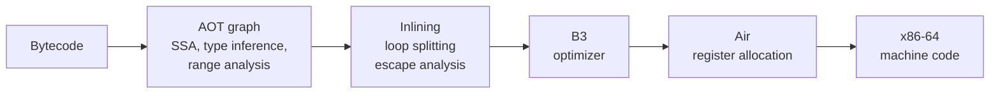

# Architecture

This document explains what a Pi-Bolt executable contains, how it is built, and what happens when it starts.

- [The executable](#the-executable)
- [Build pipeline](#build-pipeline)
- [The ahead-of-time compiler](#the-ahead-of-time-compiler)
- [Launch](#launch)
- [JIT off and JIT on](#jit-off-and-jit-on)
- [The x86-64 port](#the-x86-64-port)
- [Limitations](#limitations)

## The executable

A Pi-Bolt executable is a Bun single-file executable with two extra sections appended:

```
┌──────────────────────────────┐
│ Bun runtime                  │  Bun + JavaScriptCore (with the AOT engine), ICU, statically linked
├──────────────────────────────┤
│ Bundled program              │  Pi's modules, as Bun's --compile embeds them (bytecode optional)
├──────────────────────────────┤
│ Static heap                  │  the JavaScript heap after Pi's modules were loaded and evaluated
├──────────────────────────────┤
│ Code image                   │  machine code for every function, regular expressions, metadata
├──────────────────────────────┤
│ Trailer                      │  offsets, engine stamp, CPU features and options the code was compiled for
└──────────────────────────────┘
```

Both appended sections are page-aligned, so that they can be mapped directly from the file.

## Build pipeline

`scripts/build-pi.sh` runs `bun build --compile --bytecode` with the Pi-Bolt runtime and these settings:

| Setting | Effect |
|---|---|
| `BUN_STATIC_HEAP=1` | Build the static heap. |
| `BUN_AOT=1` | Compile every function ahead of time into the code image. |
| `BUN_AOT_JIT=0` | Mark the code as running with the JIT off. This is the default build; `--jit on` leaves it out. |
| `BUN_JSC_omitBytecodeFromStaticHeap=1` | Leave bytecode out of the heap. Functions run from machine code only. This saves memory and enables program-wide numbering of identifiers and constants, which cross-function inlining needs. |
| `BUN_JSC_useAOTLoopSplitting=1`, `BUN_JSC_aotLoopSplittingPolicy=5` | Give loops a fast copy (see below). |
| `--bytecode-order=profiles/.../bytecode.order` | Lay out code and heap in the order the training session first used them. |
| `BUN_JSC_aotRegExpsPath=profiles/.../regexps.txt` | Compile regular expressions that Pi builds from strings at run time, as well as its literals. |

The steps are:

1. **Bundle.** Bun resolves Pi's module graph from `dist/bun/cli.js` and its two worker entries, and transpiles and links it.
2. **Bytecode.** Every module and function is compiled to JavaScriptCore bytecode, and the module graph is prelinked.
3. **Evaluate into a heap.** Pi's modules are loaded and evaluated in a VM whose heap is laid out for snapshotting. The result is
   serialized, with every pointer relocatable to a fixed address: the static heap.
4. **Compile.** The ahead-of-time compiler turns every function's bytecode into machine code, linked as one image.
5. **Append.** The heap, the image and a trailer are appended to the executable.

## The ahead-of-time compiler

The compiler comes from [oven-sh/WebKit#743](https://github.com/oven-sh/WebKit/pull/743). It takes JavaScriptCore bytecode
through its own graph and analyses, then through B3 and Air: the back end of JavaScriptCore's top-tier FTL JIT.



A JIT learns what types flow through the code by watching it run. The AOT compiler has no such feedback, so it works from what
it can prove:

- **Type inference** over the whole program: types of locals, module bindings that always hold the same function, constants.
- **Guards** for what it assumes but cannot prove (a value is an int32, an object has a given shape), with a generic path when a
  guard fails. Nothing is deoptimized; the generic path is part of the compiled code.
- **Stubs**: shared machine-code routines for the generic paths (property access with inline caches, calls, arithmetic on
  unknown types). They keep the code compact, so a slow path costs a call, not code in every function.
- **Inline caches** for property access, filled in at run time, with a polymorphic inline check where it pays off.
- **Intrinsics** for hot built-ins: `Math.*`, `charCodeAt`, `push`/`pop`, and `Map`/`Set` `get`/`has`/`set`/`add`.
- **Inlining** of known small functions across the program: function declarations, functions held in module constants that
  are never reassigned, and methods whose name the program defines exactly once. A call through a constant checks that it has
  been initialized, and throws as it would if not. A method call checks that the callee is the function it was taken for, and
  makes the call if not; inside a loop's fast copy, that check leaves for the generic copy, so the fast copy keeps no call.
- **Array callbacks**: `forEach`, `map`, `filter`, `reduce` and the like are inlined with their callback. The standard objects'
  original methods are frozen when the program starts (`useImmutableIntrinsics`), which is what makes `[].map` knowable.
- **Loop splitting**: a loop gets a fast copy without slow paths, which falls back to a generic copy at the first failed check.
  This applies to loops without real calls, and to loops whose calls are to built-ins or known module functions, or that
  index arrays. String scanning and number crunching run several times faster this way.
- **Number encoding**: a number the compiler holds as a double is boxed as an int32 whenever it is one, as JavaScriptCore's
  `jsNumber()` does. Every fast path downstream (indexing, `charCodeAt`, compares, inline caches) is for int32s, so a counter
  boxed as a double would miss them all.
- **Regular expressions**: compiled by Yarr, JavaScriptCore's regular-expression compiler, into the same image. This covers
  literals, plus patterns the training profile recorded being built at run time.

## Launch

When the executable starts:

1. Bun finds the trailer and checks it against the engine:
   - the engine stamp must match exactly;
   - the CPU must have the instruction-set features the code was compiled for;
   - the address range the heap and code expect must be available.
2. **The static heap is mapped** at its fixed address in the static region (0x200000000000), copy-on-write from the executable
   file. Structures go to the 4 GB right after it, where the code expects them.
3. **The code image is mapped** executable and registered with the VM. Functions in the heap point straight at their machine
   code.
4. Pi's `main()` runs. Its modules are already evaluated, so nothing is parsed, compiled or initialized again.

If any check fails, the executable prints one notice and runs from bytecode instead: correct, just slower to start. The checks
are the engine stamp, the CPU features, the address space (for example a tight `ulimit -v`), and `BUN_AOT=0`. See
[TROUBLESHOOTING.md](TROUBLESHOOTING.md).

### Where the memory goes

- **Code and the static heap are file-backed.** Pages that are only read are shared with the page cache, and the kernel can drop
  them under memory pressure. A process's own memory (private dirty pages) is what it writes.
- **No JIT.** With the JIT off there are no compiler threads, no JIT code caches and no profiling data.
- **No bytecode**, because it is left out of the heap.

## JIT off and JIT on

| | JIT off (default) | JIT on (`--jit on`) |
|---|---|---|
| Pi's own code | AOT machine code | AOT machine code; it does not tier up |
| Code loaded at run time (run-time plugins, `eval`) | interpreter | interpreter, then baseline JIT, DFG and FTL as it warms up |
| Memory | lowest | higher once the JIT has compiled anything |
| Choose it for | Pi with compiled-in plugins | heavy use of run-time-loaded plugins |

## The x86-64 port

The upstream compiler targets ARM64: on x86-64 nothing was compiled ahead of time. Pi-Bolt's
[WebKit patch](../patches/webkit) adds the x86-64 back end and runtime work, and its [Bun patch](../patches/bun) adds the
executable format.

**x86-64 code generation**

- A register convention for stubs on x86-64's smaller register file. Stubs work in the C argument and scratch registers. "Light"
  stubs also preserve `rbx` and `r12`, so values the caller keeps there survive a property access.
- Every stub family ported: property access, calls, arithmetic and comparisons, iteration, intrinsics, `Map`/`Set` lookups, and
  bit operations on doubles.
- Regular expressions with the `u` or `v` flag: the surrogate-pair slow path is generated into the image, so Unicode patterns
  run as machine code too.
- Truncation of doubles to int32 with a short inline sequence, instead of a C call.
- `charAt`/`charCodeAt` resolve a substring in place, as `codePointAt` already did, so the compiled fast paths read it directly.

**Runtime**

- Realms other than the main one (`ShadowRealm`, `vm` contexts) commit their memory lazily, not 400 MB up front.
- Address-space limits are handled: the static region and allocation pools shrink or fall back when `RLIMIT_AS` or
  `vm.overcommit_memory=2` will not give them their usual reservation.
- Worker threads share the static heap.
- Portable executables: the build links against a glibc 2.17 sysroot with static ICU.

**Executable format (Bun)**

- `bun build --compile` appends the static heap and code image, and the executable maps them at launch, with a fallback to
  bytecode when it cannot.
- Training profiles: function order output (`BUN_BYTECODE_ORDER_OUT`) and run-time regular-expression recording.

## Limitations

- **Linux x86-64 only** for now. The engine's ARM64 back end exists upstream; Pi-Bolt does not build or test ARM64 executables
  yet.
- **Code loaded at run time is not compiled ahead of time.** With the JIT off it is interpreted. Compile plugins in
  ([PLUGINS.md](PLUGINS.md)) or use the JIT-on build.
- **No type feedback.** A warmed-up JIT specializes on the types it actually observes, and the AOT compiler can only use what
  it proves. Code written so that types are predictable gets the fast paths ([PLUGINS.md](PLUGINS.md#performance-guide)).
  Pi itself, including the long streaming phases, now uses less CPU than stock Bun's warmed-up JIT
  ([BENCHMARKS.md](BENCHMARKS.md)).
- Each executable is built for one Pi version and one engine. The executable checks the engine stamp at launch.
