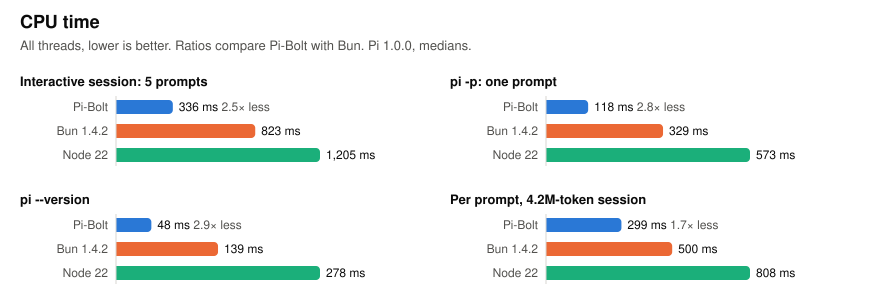
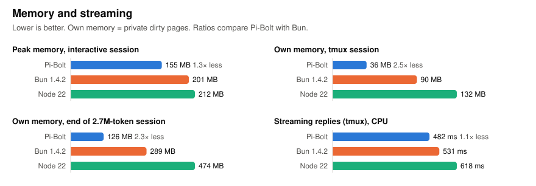
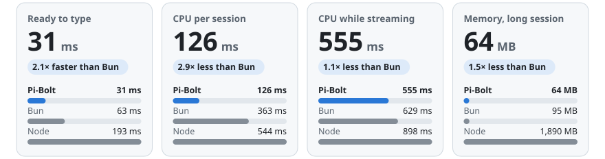
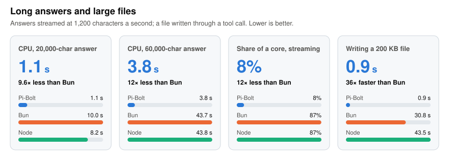
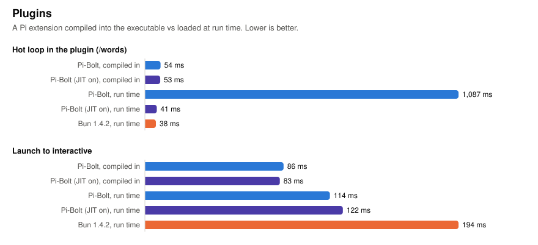

# Benchmarks

Pi-Bolt compared with the same Pi release on stock Bun and on Node.js. Every figure comes from the tools in
[`bench/`](../bench), and the raw results are in [`bench/results/`](../bench/results). The charts are drawn from those files by
[`bench/report.py`](../bench/report.py).

- [Results](#results)
- [macOS on Apple silicon](#macos-on-apple-silicon)
- [Setup and method](#setup-and-method)
- [In a real terminal (tmux)](#in-a-real-terminal-tmux)
  - [What Pi writes to the terminal](#what-pi-writes-to-the-terminal)
- [Long answers and large files](#long-answers-and-large-files)
- [Plugins](#plugins)
- [Questions](#questions)
  - [Why is a run-time plugin's loop 1,080 ms on Pi-Bolt and 38 ms on Bun?](#why-is-a-run-time-plugins-loop-1080-ms-on-pi-bolt-and-38-ms-on-bun)
  - [Did Pi-Bolt get slower when it was made production-ready?](#did-pi-bolt-get-slower-when-it-was-made-production-ready)
  - [How was the streaming gap closed?](#how-was-the-streaming-gap-closed)
- [Reproduce](#reproduce)
- [Correctness](#correctness)

## Results

<picture>
  <source media="(prefers-color-scheme: dark)" srcset="images/bench-speed-dark.svg">
  
</picture>

<picture>
  <source media="(prefers-color-scheme: dark)" srcset="images/bench-cpu-dark.svg">
  
</picture>

<picture>
  <source media="(prefers-color-scheme: dark)" srcset="images/bench-memory-dark.svg">
  
</picture>

| Scenario | Metric | Pi-Bolt | Pi-Bolt, JIT on | Bun 1.4.2 | Node 22 |
|---|---|---:|---:|---:|---:|
| `pi --version` | wall | **45 ms** | 48 ms | 78 ms | 223 ms |
| | CPU | **48 ms** | 52 ms | 139 ms | 278 ms |
| `pi -p "<prompt>"`: one prompt, 5 model turns, 4 tool calls | wall | **108 ms** | 112 ms | 171 ms | 403 ms |
| | CPU | **118 ms** | 124 ms | 329 ms | 573 ms |
| Interactive TUI: launch, 5 prompts (25 model turns), `/quit` | time to interactive | **74 ms** | 76 ms | 125 ms | 299 ms |
| | time per prompt (5 model turns) | **60 ms** | 61 ms | 73 ms | 107 ms |
| | CPU | **336 ms** | 342 ms | 823 ms | 1,205 ms |
| | peak memory | **159 MB** | 163 MB | 204 MB | 212 MB |
| Long session: 75 prompts, 300 tool calls, a conversation of about 4.2M tokens | time per prompt, last 25 | **539 ms** | | 693 ms | 946 ms |
| | CPU per prompt, last 25 | **299 ms** | | 500 ms | 808 ms |
| | own memory at the end | **140 MB** | | 226 MB | 529 MB |

Medians: 21 runs of each scenario (after 3 warm-up runs), and 3 long sessions per runtime. The long-session memory is a snapshot
after the last prompt, so it depends on when the garbage collector last ran. Across sessions it was 123–144 MB for Pi-Bolt,
212–250 MB for Bun and 499–535 MB for Node. In the long session every model turn sends the whole conversation, 17 MB at the
end: its time per prompt is mostly that, on every runtime.

**Measured again for 0.5.2.** Up to 0.5.1 these tables came from tools that waited for the end of an answer by its last words.
In fullscreen mode a screen that is drawn again shows the answers before it too, and the tools took one of those for the one
they waited for: from the second prompt of a session on, the next prompt was sent while the one before was still being
answered, and cut it short, on every runtime. The interactive and long-session rows were of sessions that did less than they
say (the long session reached 2.7M tokens, not 4.2M). Answers are now numbered, and every figure here was taken again.

## macOS on Apple silicon

The same tools on an Apple M5 MacBook Air (10 cores, 16 GB, macOS 27.0.1), against Pi 1.0.0 as released on Bun 1.4.2 and its npm
package on Node 26.10. macOS cannot pin processes to cores, so runs are interleaved on an otherwise idle machine; "own memory" is
the physical footprint (what Activity Monitor shows), the closest measure to private dirty pages on Linux. Raw data:
[`bench/results/2026-10-04-darwin-arm64-vs-pi-1.0.0`](../bench/results/2026-10-04-darwin-arm64-vs-pi-1.0.0).

<picture>
  <source media="(prefers-color-scheme: dark)" srcset="images/darwin-arm64/bench-hero-dark.svg">
  
</picture>

| Scenario | Metric | Pi-Bolt | Pi-Bolt, JIT on | Bun 1.4.2 | Node 26 |
|---|---|---:|---:|---:|---:|
| `pi --version` | wall | **19 ms** | 20 ms | 32 ms | 152 ms |
| | CPU | **16 ms** | 17 ms | 57 ms | 161 ms |
| `pi -p "<prompt>"`: one prompt, 5 model turns, 4 tool calls | wall | **46 ms** | 48 ms | 71 ms | 230 ms |
| | CPU | **44 ms** | 45 ms | 144 ms | 298 ms |
| Interactive TUI: launch, 5 prompts (25 model turns), `/quit` | time to interactive | 46 ms | **42 ms** | 65 ms | 190 ms |
| | CPU | 148 ms | **146 ms** | 370 ms | 550 ms |
| | peak memory | **136 MB** | 139 MB | 198 MB | 234 MB |
| Long session: 75 prompts, a conversation of about 4.2M tokens | time per prompt, last 25 | **216 ms** | | 280 ms | 342 ms |
| | CPU per prompt, last 25 | **72 ms** | | 156 ms | 258 ms |
| | own memory at the end | **52 MB** | | 98 MB | 2,450 MB |
| tmux: replies streaming at human pace (4 prompts) | CPU | **670 ms** | | 856 ms | 900 ms |
| | own memory | **30 MB** | | 67 MB | 94 MB |
| | bytes written to the terminal per prompt | **168 KB** | | 353 KB | 355 KB |
| | CPU while idle, per second | **0.5 ms** | | 3.5 ms | 22.9 ms |
| Long answers in the TUI (1,200 characters a second) | CPU, 20,000 characters | **1.8 s** | | 6.8 s | 6.2 s |
| | CPU, 60,000 characters | **7.0 s** | | 26.3 s | 25.4 s |
| A file written through a tool call (`pi -p`) | 200 KB: wall / CPU | **0.3 / 0.2 s** | | 11.4 / 19.5 s | 14.0 / 14.3 s |
| The same in the TUI | longest pause in drawing, 200 KB | **82 ms** | | 86 ms | 139 ms |
| A plugin's hot loop | compiled in | **44 ms** | 44 ms | | |
| | loaded at run time | 485 ms | **39 ms** | 40 ms | |

Medians of 21 runs (3 warm-up runs), 3 long sessions and 5 tmux rounds per runtime.

**CPU time understates the difference on Apple silicon.** macOS runs a light, bursty process on the efficiency cores or at a low
clock, and a busy one fast. While a 20,000-character answer streams, Pi-Bolt executes 4.0 billion instructions in 2.8 billion
cycles (an average 1.2 GHz), and Bun 49 billion in 16.8 billion cycles (2.3 GHz): a sixth of the work, in a third of the CPU time.
Linux, on a server CPU at a fixed clock, shows the work more directly (half the CPU of Bun, and 6-7% of a core while streaming).

**Every runtime uses more CPU for streaming here than on Linux.** On the same benchmark Bun takes 880 ms on macOS against 493 ms on
the EPYC, and Node 952 against 580: a terminal and timers that cost more per frame, and a model server whose pacing is coarser,
so that a prompt takes 8.6 s rather than 6.5 s and draws 515 frames rather than 423.

**What macOS adds at launch.** An executable with a prebuilt heap runs with ASLR off for its own code: `pi`, a small launcher,
starts it that way at once ([ARCHITECTURE.md](ARCHITECTURE.md#the-macos-arm64-port)). The figures are of the release builds, launcher
included.

## Setup and method

| | |
|---|---|
| Pi | 1.0.0 (`v1.0.0`, a13d35a7) |
| Machine | AMD EPYC 7B13 (Zen 3), Linux 7.0, every run pinned to the same 8 cores |
| **Pi-Bolt** 0.5.2 | `scripts/package-release.sh`: Pi 1.0.0 with Pi-Bolt's changes to how the terminal is drawn, compiled ahead of time, JIT off, CPU `native` |
| **Bun 1.4.2** | Pi 1.0.0 as released, built with Pi's own `bun build --compile` command, plus `--bytecode` (which makes stock Bun start faster) |
| **Node 22.23.3** | Pi 1.0.0 as released: its npm package (`dist/bundle/cli.js`, with Node's compile cache) |

**The model.** A local server ([`bench/fake_model.py`](../bench/fake_model.py)) speaks the OpenAI chat-completions protocol and
streams a scripted conversation: for each prompt, four `read` tool calls on Pi source files, then an answer. There is no network
and no model latency, so the figures measure Pi and its runtime.

**Isolation.**

- Each run gets a fresh Pi home with only that model configured, and an environment cleared of `BUN_*`, `NODE_*` and `PI_*`.
- Runs are interleaved round-robin across builds, so background load affects all of them alike.

**Metrics.**

- **Wall**: elapsed time.
- **CPU**: user plus system time of all threads, from `wait4()` or the scheduler's per-thread statistics.
- **Peak memory**: maximum resident set.
- **Own memory**: private dirty pages (`smaps_rollup`). This is what a process costs beyond shared and file-backed pages, which
  matters for Pi-Bolt: its code and prebuilt heap are file-backed.

**The machine is shared.** It is a cloud VM that other heavy jobs also use. Interleaving keeps comparisons fair, but absolute
figures vary between sessions. Figures from sessions taken under heavy load were discarded and re-run.

## In a real terminal (tmux)

Pi in a 160×48 tmux pane ([`bench/tmux_check.py`](../bench/tmux_check.py)): keys sent with `send-keys`, the screen read back
with `capture-pane`, and the model streaming at human pace, one event every 10 ms.

| | Pi-Bolt | Bun 1.4.2 | Node 22 |
|---|---:|---:|---:|
| time to interactive | **89 ms** | 151 ms | 329 ms |
| keystroke to screen, median | 5.1 ms | 5.1 ms | 5.2 ms |
| 20 KB paste | 5.7 ms | 5.5 ms | 10.7 ms |
| **CPU while 4 replies stream** (6.5 s) | **366 ms** | 493 ms | 580 ms |
| written to the terminal for a reply | **138 KB** | 324 KB | 323 KB |
| idle CPU at the prompt | 0.7 ms/s | 2.8 ms/s | **0.3 ms/s** |
| own memory, start → end | **33 → 33 MB** | 60 → 85 MB | 59 → 133 MB |
| resize while streaming, Escape to abort, prompt after abort, `/quit`, errors on screen | all ok, none | all ok, none | all ok, none |

Medians of 5 rounds of 4 prompts each. Keystroke latency is the terminal's own round trip and is the same everywhere. Pi-Bolt
uses a quarter less CPU than Bun's warmed-up JIT while replies stream, and less than half of Bun's private memory. Node uses
the least CPU at the idle prompt.

### What Pi writes to the terminal

Everything Pi writes, tmux parses and draws again for its client, and an ssh connection or `docker exec` carries.
[`bench/tmux_load.py`](../bench/tmux_load.py) runs Pi in a tmux pane with a client attached while a 20,000-character Markdown
answer streams in at 1,200 characters a second:

| | Pi-Bolt | Bun 1.4.2 | Node 22 |
|---|---:|---:|---:|
| Pi writes to the pane | **0.5 MB** | 3.6 MB | 3.6 MB |
| tmux sends its client | **0.28 MB** | 1.4 MB | 1.4 MB |
| CPU of the tmux server | **0.16 s** | 0.66 s | 0.62 s |
| CPU of Pi | **1.0 s** | 10.1 s | 8.1 s |

In fullscreen mode, Pi's default, a line added to the transcript moves every row of the screen, and Pi writes every row again.
Pi-Bolt (from 0.5.2) scrolls the rows that only moved, with a scroll region and line feeds, and draws what differs afterwards.
What the screen shows is the same: [`bench/e2e_fullscreen.py`](../bench/e2e_fullscreen.py) compares every screen, text and
colors, with and without it, in tmux and in zmx, also inside a container. `PI_TUI_SCROLL_ROWS=0` turns it off. Means of two
runs.

## Long answers and large files

<picture>
  <source media="(prefers-color-scheme: dark)" srcset="images/bench-long-dark.svg">
  
</picture>

| | Pi-Bolt | Bun 1.4.2 | Node 22 |
|---|---:|---:|---:|
| Streaming a 20,000-character answer: CPU | **1.1 s** | 10.0 s | 8.2 s |
| Streaming a 60,000-character answer: CPU | **3.8 s** | 43.7 s | 43.8 s |
| Share of a core while it streams (60,000 characters) | **8%** | 87% | 87% |
| Own memory after the 60,000-character answer | **52 MB** | 148 MB | 249 MB |
| Writing a 50 KB file through a tool call (`pi -p`) | **0.3 s** | 1.9 s | 2.8 s |
| Writing a 200 KB file through a tool call (`pi -p`) | **0.9 s** | 30.8 s | 43.5 s |
| Writing a 200 KB file through a tool call: CPU | **0.6 s** | 74.5 s | 44.5 s |
| The same in the TUI: longest stretch without a frame, 50 KB | **0.08 s** | 10.6 s | 9.8 s |
| longest stretch without a frame, 200 KB | **0.08 s** | 52 s | 57 s |

`bench/long_answer.py` streams Markdown answers (headings, lists, code blocks in several languages, tables) into the TUI at 1,200
characters a second, 24 at a time, and measures the CPU Pi uses until the answer has been drawn. `bench/large_write.py` has the
model write a file of TypeScript through the `write` tool, its arguments streaming 16 characters at a time (about one token),
and measures `pi -p` from start to exit. Means of two runs, which differed by at most 5%; pinned to 8 cores. Bun and Node run
Pi 1.0.0 as released (`v1.0.0`): Bun built with `scripts/build-pi.sh --stable --pi <Pi 1.0.0>`, Node from Pi's npm bundle.
`bench/pauses.py` writes the same files in the TUI and reports the longest time between two writes to the terminal: while
it lasts nothing is drawn and no key is taken. Raw data, with the main results:
[`bench/results/2026-10-03-pi-bolt-0.5.2`](../bench/results/2026-10-03-pi-bolt-0.5.2); `bench/report.py` draws the chart from it.

Both come from Pi's own code, not from the runtime. Pi draws a message again each time a few more words arrive, with a new
component that lexes the whole Markdown text, renders and wraps every block and highlights every code block, so the cost of each
redraw grows with the length of the answer. Pi-Bolt keeps what it lexed and rendered, and does again only the last two blocks
(where a block ends depends on the line after it); highlighted code is kept by language and text. What is drawn is the same, line
for line and color for color (`bench/e2e_screen.py`). Pi also parses all of a tool call's arguments each time a few more
characters arrive; Pi-Bolt parses them again only once they have grown by an eighth while they stream, and in full when the call
is complete. And Pi highlights every line of a file being written, and all of it again on every redraw once it is complete;
Pi-Bolt highlights the lines a collapsed call shows, and the rest when the call is expanded.

## Plugins

The example plugin ([`examples/plugins`](../examples/plugins)): a `/words` command that counts the words of a 16.8 MB file in a
character loop, timed inside Pi with `performance.now()`. See [PLUGINS.md](PLUGINS.md).

<picture>
  <source media="(prefers-color-scheme: dark)" srcset="images/bench-plugins-dark.svg">
  
</picture>

| How the plugin runs | Launch to interactive | `/words` hot loop |
|---|---:|---:|
| **Compiled in**, Pi-Bolt (default, JIT off) | **78 ms** | **50 ms** |
| Compiled in, Pi-Bolt JIT on | 76 ms | 49 ms |
| Loaded at run time, Pi-Bolt JIT off (interpreted) | 109 ms | 1,105 ms |
| Loaded at run time, Pi-Bolt JIT on | 109 ms | 38 ms |
| Loaded at run time, Bun 1.4.2 | 194 ms | 38 ms |
| *No plugin: Pi-Bolt / Bun* | *75 ms / 128 ms* | |

Medians of 5 sessions, each running `/words` 5 times. The hot-loop figure is the median of runs 2–5.

## Questions

### Why is a run-time plugin's loop 1,080 ms on Pi-Bolt and 38 ms on Bun?

Because that plugin's code is not compiled at all on that build: it runs in JavaScriptCore's bytecode interpreter.

- The default Pi-Bolt executable runs with the **JIT off**. Pi's own code does not need a JIT: all of it was compiled to machine
  code when the executable was built.
- A plugin loaded at **run time** (from `~/.pi/agent/extensions`, a project's `.pi/extensions` or a Pi package) is not part of
  that build. `jiti` turns its TypeScript into JavaScript when Pi starts. With no JIT, JavaScriptCore can then only interpret
  it, and an interpreter runs a tight loop 20–30× slower than compiled code.
- Stock Bun's JIT compiles the loop after a few thousand iterations, which is how it gets to 38 ms.

This is not a regression. The figure is the same in every Pi-Bolt release: it is the cost of loading code at run time into a
runtime with no JIT. There are two ways around it:

| | Plugin hot loop |
|---|---:|
| Compile the plugin in: `scripts/build-pi.sh --plugins` ([PLUGINS.md](PLUGINS.md)) | 50 ms, and 3 ms at launch instead of 34 ms |
| Use the JIT-on build (`pi-bolt-linux-x64-jit`) and keep loading it at run time | 38 ms after warm-up (Bun: 38 ms) |
| Load it at run time on the default (JIT-off) build | 1,105 ms |

### Did Pi-Bolt get slower when it was made production-ready?

No. The release work changed three things:

- a portable runtime, linked against a glibc 2.17 sysroot with ICU built in;
- loop splitting;
- a retrained profile.

The last build before the release work, v0.1.0 and stock Bun were measured together, interleaved, 21 runs each
([raw data](../bench/results/2026-10-02-prerelease-vs-v0.1.0)):

| | Pre-release | v0.1.0 | Bun 1.4.2 |
|---|---:|---:|---:|
| `pi --version`, wall / CPU | 50 / 53 ms | **47 / 50 ms** | 77 / 140 ms |
| `pi -p`, wall / CPU | 113 / 127 ms | **109 / 123 ms** | 161 / 312 ms |
| interactive: time to interactive / CPU / peak memory | 79 ms / 395 ms / 159 MB | **76 ms / 381 ms / 153 MB** | 126 ms / 829 ms / 202 MB |
| long session, time / CPU per prompt (last 25, median of 3) | 157 / 93 ms | **150 / 92 ms** | 215 / 163 ms |

v0.1.0 was as fast or faster on every metric.

What does vary is streaming CPU in tmux. It is the most load-sensitive measurement on this shared machine, and v0.1.0 measured
531 ms in one session and 578 ms in another. That variation is noise. What the follow-up review did find is a real gap: stock
Bun's warmed-up JIT used 5–15% less CPU than v0.1.0 while replies streamed. v0.2.0 closes it, as the next answer explains.

### How was the streaming gap closed?

A profile of the TUI while replies stream showed what was different. Pi-Bolt spent 8% of its CPU calling the native
`String.prototype.charCodeAt`, once per character, from pi-tui's `visibleWidth()`, which measures every line on every frame.
Three engine fixes followed ([patch 0002](../patches/webkit)):

1. **Integer counters boxed as doubles.** `visibleWidth`'s loop counter is updated with `i += ansiCodeLength(...)`, so the
   compiler could not prove it an integer and kept it as a double. Boxed as a double, it missed the int32 fast path of
   `charCodeAt`, and every character went to C. Numbers are now boxed as int32 whenever they are integers, as JavaScriptCore's
   `jsNumber()` does.
2. **Substrings.** `slice()` and `split()` return substrings that `charAt`/`charCodeAt` read without resolving them, so the
   fast path never applied to them. They are now resolved on first use, as `codePointAt` already did.
3. **Faster loops with calls.** The loop-splitting mode that also covers loops calling known functions (policy 5) had been left
   off, because it miscompiled a spread call. The bug was found and fixed: a spread's result arriving through a phi was passed
   as one argument. Policy 5 is now on, and JavaScriptCore's test suite gives the same results with it as without.

| Streaming 4 replies in tmux, CPU (median of 5 rounds) | |
|---|---:|
| v0.1.0 | 531 ms |
| v0.2.0 engine, loop policy 3 | 496 ms |
| **v0.2.0** (policy 5) | **468 ms** |
| Bun 1.4.2, warmed-up JIT | 516 ms |

This was an earlier session than the main results, of Pi-Bolt 0.2.0 ([raw data](../bench/results/2026-10-02-streaming-fix));
0.5.2 is at 366 ms. pi-tui's `visibleWidth` loop on its own: 25 ms → 6.3 ms (Bun: 2.4 ms).

## Reproduce

```bash
scripts/package-release.sh                      # out/pi-bolt, out/pi-bolt-baseline, out/pi-bolt-jit
scripts/build-pi.sh --stable --out out/pi-stable
scripts/build-pi.sh --plugins examples/plugins/plugins.ts --out out/pi-bolt-plugins
scripts/build-pi.sh --plugins examples/plugins/plugins.ts --jit on --out out/pi-bolt-plugins-jit
scripts/build-pi.sh --stable --pi ../pi-1.0.0 --out out/pi-stable-upstream     # Pi as released, in a checkout of its tag
PIBOLT_PI=../pi-1.0.0 PIBOLT_STABLE_PI=out/pi-stable-upstream/pi \
	bench/run-suite.sh bench/results/my-run --cpus 8-15   # about an hour; then charts and tables from bench/report.py
python3 bench/long_answer.py --cpus 8-15 --build pi-bolt=out/pi-bolt/pi --build bun=out/pi-stable/pi --sizes 20000,60000
python3 bench/large_write.py --cpus 8-15 --build pi-bolt=out/pi-bolt/pi --build bun=out/pi-stable/pi --sizes 50,200
python3 bench/tmux_load.py --cpus 8-15 --build pi-bolt=out/pi-bolt/pi --build bun=out/pi-stable/pi --steps md:20000
python3 bench/pauses.py --cpus 8-15 --build pi-bolt=out/pi-bolt/pi --build bun=out/pi-stable/pi --steps write:50,write:200
```

Each tool also runs on its own, with any builds given as `--build name=command`. See [`bench/README.md`](../bench/README.md).

## Correctness

Speed is only measured on builds that pass the correctness checks:

- `bench/e2e_tools.py`: every Pi tool, with output and files byte-identical to stock Bun's.
- `bench/ui_check.py` and `bench/tmux_check.py`: the TUI.
- `tests/aot/run.sh`: engine tests, including regression tests for the v0.2.0 fixes.
- JavaScriptCore's own stress tests, run with and without AOT compilation: 4,779 of the 4,786 that run behave the same. The 7
  that differ inspect JIT internals that do not exist without a JIT.

See [BUILDING.md](BUILDING.md#tests).
