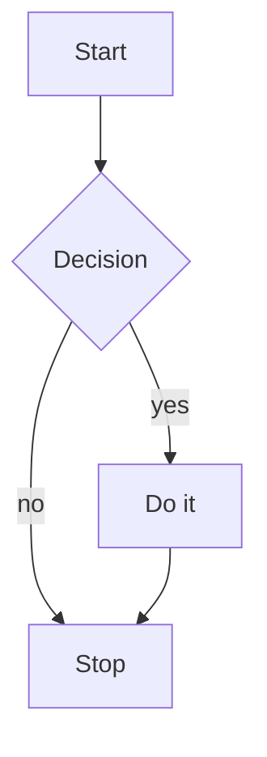

# Training answer

This answer is streamed to Pi while a training profile is recorded (`scripts/train-profile.sh`). It uses every kind of
Markdown and a code block in every language Pi highlights, so that the regular expressions the Markdown parser and the
highlighter build at run time are run, recorded, and compiled into the executable. Text with characters outside
Latin-1 is here too: naïve café — 日本語 한국어 हिन्दी العربية עברית 😀 🇮🇳 👨‍👩‍👧.

## Inline

Some **bold**, *italic*, ***both***, __bold__, _italic_, ~~struck~~, `inline code`, ``code with ` a tick``, a
[link](https://example.com/path?q=1&r=2 "title"), an autolink <https://example.org>, a bare one https://example.net/x_y,
an email <someone@example.com>, an image , a footnote-like [^1], a reference
[link][ref], HTML <kbd>Ctrl</kbd>+<kbd>C</kbd> and <!-- a comment -->, an entity &amp; &lt; &#35; &copy;, escapes \* \_
\` \# \\, a hard break at the end of this line  
and one with a backslash\
then inline math $E = mc^2$, \(a^2 + b^2 = c^2\) and a price of $5 that is not math.

[ref]: https://example.com/reference "Reference"
[^1]: The footnote.

Setext heading one
==================

Setext heading two
------------------

### Lists

- a bullet
- another
  with a lazy continuation
  - nested
    - deeper, with `code`
  - back
* a star bullet
+ a plus bullet

1. first
2. second
   1. nested ordered
   2. more
10. tenth

- [ ] a task
- [x] a done task

- a loose list

- with blank lines

  and a paragraph inside an item

      and indented code in it

### Quotes, rules, tables

> A quote
> over two lines, with **bold**
>
> > nested
> - a list in a quote
> ```sh
> echo "code in a quote"
> ```

---
***
___

| Left | Center | Right |
|:-----|:------:|------:|
| a | `b` | 1.5 |
| **c** | [d](https://example.com) | -2 |
| e \| f | 日本語 | 1e3 |

Term without a table | just | pipes

<details>
<summary>An HTML block</summary>

Inside the block.

</details>

<div align="center"></div>

$$
\int_0^1 x^2 \, dx = \frac{1}{3}, \quad \sum_{i=1}^{n} i = \frac{n(n+1)}{2}
$$

\[
\alpha \le \beta \ne \gamma \to \infty
\]

    an indented code block
    with two lines

```
a fence without a language
```

~~~text
a tilde fence
~~~

## Code

```typescript
// A line comment, and a /* block */ one below.
/**
 * A doc comment with a @param tag and a {@link Thing}.
 */
import { readFile, type Stats } from "node:fs/promises";
import * as path from "path";

export interface Shape<T extends object = {}> { readonly kind: "circle" | "square"; area?(): number; data: T[] }
type Fn = (a: number, ...rest: string[]) => Promise<void>;
enum Color { Red = 1, Green = 0x2, Blue = 0b11 }
declare module "x" { export const y: unique symbol; }

@decorator({ option: true })
export abstract class Base<T> implements Shape<T> {
	static #count = 0n;
	private readonly values: Map<string, T> = new Map();
	constructor(public kind: "circle" | "square", protected data: T[] = []) { super(); }
	get size(): number { return this.values.size ?? 0; }
	async *items(): AsyncGenerator<T, void, undefined> { for await (const v of this.data) yield v as T; }
}

const re = /^(?<year>\d{4})-(\d{2})[^a-z\s]*$/giu, n = 1_000.5e-3, hex = 0xff, oct = 0o17, big = 123n;
const tpl = `template ${n + 1} with ${`nested ${hex}`} parts`, s = 'single \'quoted\'', d = "double \"quoted\" \n\t\u00e9";
let u: undefined | null = null, v = u ?? (typeof s === "string" ? s!.length : void 0), w = <const>["a", 1];
function generic<K extends keyof T, T>(obj: T, key: K): T[K] { if (!obj) throw new TypeError(`no ${String(key)}`); return obj[key]; }
label: for (let i = 0; i < 10; i++) { if (i % 2 === 0) continue label; else break; }
try { await readFile(path.join(__dirname, "x")); } catch (e: unknown) { console.error(e instanceof Error && e.message); } finally { }
export default class extends Base<number> {}
```

```javascript
#!/usr/bin/env node
"use strict";
const { a, b: [c = 1, ...rest], ...others } = require("./module.js");
import defaultExport, * as everything from "pkg";
export const arrow = async (x, y = 2) => ({ sum: x + y, [`key${x}`]: x ** y, x, method() { return super.method?.(); } });
class Animal extends Object { static create() { return new this(); } #secret = 1; get [Symbol.toStringTag]() { return "Animal"; } }
function* gen() { yield* [1, 2, 3]; return 0xDEADBEEF + 0b1010 + 0o777 + 1e10 + .5 + 5. + 1_000n; }
const re = /ab+c/i.test("abbc") && /[/\]]+/.exec("a/b]") || new RegExp("\\d+", "g");
if (typeof window !== "undefined" && window?.document instanceof Document) { debugger; } else if (NaN !== Infinity) { delete others.x; }
switch (a) { case 1: break; default: do { c--; } while (c > 0); }
const jsx = <div className="x" onClick={() => go()}>text {value} <Child {...props} /></div>;
process.on("exit", (code) => console.log(`exit ${code}`, new.target, import.meta.url, arguments.length, this, null, undefined, true, false));
```

```python
#!/usr/bin/env python3
"""Module docstring."""
from __future__ import annotations
import os, sys
from dataclasses import dataclass, field
from typing import Optional, Union, TypeVar, Generic

T = TypeVar("T")

@dataclass(frozen=True)
class Point(Generic[T]):
    x: float = 0.0
    y: float = field(default=1e-3)
    tags: list[str] = field(default_factory=list)

    def __post_init__(self) -> None:
        '''Single-quoted docstring.'''
        assert self.x >= 0, f"negative: {self.x!r:>10.2f} {{braces}}"

    @property
    def norm(self) -> float:
        return (self.x ** 2 + self.y ** 2) ** 0.5

    @staticmethod
    async def load(path: str, *args, **kwargs) -> Optional["Point"]:
        async with open(path) as f:
            async for line in f:
                yield line
        return None

def main(argv: list[str] | None = None) -> int:
    raw, byt, uni = r"raw\d+", b"bytes\x00", u"unicode \N{BULLET} \u00e9"
    nums = [0, 1_000, 0x1F, 0o17, 0b101, 1.5e10, 3j, .5, 10 // 3, 2 ** 8, ~1 ^ 2 | 3 & 4 << 1 >> 1]
    comp = {k: v for k, v in zip("ab", range(2)) if v is not None and k not in ("z",)}
    lam = lambda x, /, y=1, *, z: x if x else (y or z)
    try:
        with open(os.path.join(sys.argv[0])) as f, open(__file__) as g:
            print(f.read(), end="", file=sys.stderr)
    except (OSError, ValueError) as e:
        raise RuntimeError("failed") from e
    else:
        pass
    finally:
        del comp
    while True:
        match argv:
            case [first, *rest] if first == "x":
                break
            case _:
                continue
    global T; nonlocal_like = True; print(None, True, False, NotImplemented, Ellipsis, ..., self := 1)
    return 0

if __name__ == "__main__":
    sys.exit(main())
```

```bash
#!/usr/bin/env bash
set -euo pipefail
# a comment
readonly NAME="${1:-world}"; export PATH="$HOME/bin:$PATH"
declare -A map=([a]=1 [b]=2); local_array=(one "two words" $'tab\t')
function greet() { local who=$1; echo "Hello, ${who^^}! $(date +%Y-%m-%d) $((1 + 2 * 3)) `uname -s`"; return 0; }
greet "$NAME" | tee -a /tmp/log.txt 2>&1 >/dev/null || true
if [[ -f "$0" && ! -d /nonexistent || "$NAME" =~ ^[a-z]+$ ]]; then printf '%s\n' "${map[@]}" "${#local_array[@]}" "${NAME//o/0}"; elif [ "$#" -gt 1 ]; then :; else exit 1; fi
for f in *.txt; do case "$f" in a*|b?) continue ;; *) break ;; esac; done
while read -r line; do echo "$line"; done < <(grep -E 'x|y' file) <<< "here string"
cat <<'EOF' > out.txt
heredoc $NOT_EXPANDED
EOF
cat <<-EOT
	expanded $NAME
	EOT
until false; do sleep 0.1 & wait $!; kill -0 $$ && trap 'echo bye' EXIT INT; done; [ -z "${UNSET+x}" ] && unset NAME
```

```json
{
	"name": "example", "version": "1.0.0", "private": true, "count": -12.5e+3, "nothing": null,
	"nested": { "list": [1, 2.0, "three", false, { "deep": [] }], "escaped": "quote \" slash \\ unicode \u00e9 \n" }
}
```

```c
/* block comment */
// line comment
#include <stdio.h>
#include "local.h"
#define MAX(a, b) ((a) > (b) ? (a) : (b))
#ifdef DEBUG
#  pragma once
#endif
typedef struct node { int value; struct node *next; unsigned char flags : 3; } node_t;
static const char *names[] = { "a", "b\n", "\x41\101" };
enum color { RED, GREEN = 2 }; union u { float f; long l; };
extern volatile int counter; inline static int add(register int a, const int b) { return a + b; }
int main(int argc, char **argv) {
	unsigned long long big = 0xFFFFFFFFULL; double d = 1.5e-3f; char c = 'x'; size_t n = sizeof(node_t);
	for (int i = 0; i < argc; ++i) { if (!argv[i]) goto done; else printf("%d: %s\n", i, argv[i]); }
	switch (c) { case 'x': break; default: do { n--; } while (n > 0); }
done:
	return (int) (big >> 3 & 1) ? EXIT_FAILURE : 0;
}
```

```cpp
#include <vector>
#include <memory>
#include <string_view>
namespace app::detail { template <typename T, std::size_t N = 3> requires std::integral<T> class Buffer final : public Base<T> {
public:
	explicit Buffer(std::initializer_list<T> init) noexcept : data_{init} {}
	virtual ~Buffer() override = default;
	[[nodiscard]] constexpr auto size() const -> std::size_t { return data_.size(); }
	template <class U> friend bool operator<=>(const Buffer&, const U&) = delete;
	T& operator[](std::size_t i) & { return data_.at(i); }
private:
	std::vector<T> data_; static inline thread_local int count_ = 0; mutable std::unique_ptr<T[]> ptr_ = nullptr;
}; }
using namespace std::literals;
int main() try {
	auto lambda = [&, x = 42](auto&&... args) mutable -> decltype(auto) { return (args + ... + x); };
	const auto s = R"raw(a "raw" string\n)raw"s; char16_t ch = u'\u00e9'; auto v = 1'000'000ull + 0x1p-3 + 0b1010;
	if (auto p = std::make_shared<int>(1); p && *p == 1) { co_await something(); throw std::runtime_error{"x"}; }
	for (const auto& [k, val] : map) static_cast<void>(dynamic_cast<Base<int>*>(nullptr)), delete new int;
	return 0;
} catch (const std::exception& e) { return 1; } catch (...) { return 2; }
```

```csharp
using System;
using System.Collections.Generic;
using static System.Math;
namespace App.Models;
#nullable enable
/// <summary>Doc comment.</summary>
[Serializable, Obsolete("old")]
public sealed partial record Person<T>(string Name, int Age = 0) : IComparable<Person<T>> where T : class, new()
{
	private readonly Dictionary<string, T?> _items = new();
	public event EventHandler? Changed;
	public string Display => $"{Name,-10} is {Age:D3} {{years}}" + @"verbatim ""quoted"" \path" + """raw string""";
	public async Task<int> RunAsync(params object[] args) { await Task.Delay(1_000); return args?.Length ?? default; }
	public static implicit operator string(Person<T> p) => p.Name;
	public int this[int i] { get => i switch { 0 => 1, > 5 and < 10 => 2, _ => throw new ArgumentOutOfRangeException(nameof(i)) }; init { } }
	unsafe void M(ref int a, out long b, in decimal c) { b = 0xFFL; fixed (int* p = &a) { checked { a += (int)1.5e3m; } } lock (this) { foreach (var x in _items) yield return x is { Key: var k } ? k : null!; } }
}
```

```java
package com.example.app;

import java.util.*;
import static java.lang.Math.max;

/** Javadoc with {@code code} and @param x. */
@SuppressWarnings({"unchecked", "rawtypes"})
public final class Main<T extends Comparable<? super T>> extends Base implements Runnable, AutoCloseable {
	private static final long SERIAL = 1L; protected volatile transient int count = 0x1F; double d = 1.5e-3d; char c = '\u0041';
	public sealed interface Shape permits Circle, Square {}
	record Circle(double radius) implements Shape {}
	enum Level { LOW, HIGH; Level next() { return values()[(ordinal() + 1) % values().length]; } }
	@Override public synchronized void run() throws IllegalStateException {
		var text = """
			a text block "quoted"
			""";
		List<String> list = new ArrayList<>(); list.stream().filter(s -> !s.isEmpty()).map(String::length).forEach(System.out::println);
		for (int i = 0; i < 10; i++) { if (i instanceof Integer n && n > 5) break; else continue; }
		try (var r = new Resource()) { assert r != null : "null"; } catch (IOException | RuntimeException e) { throw new Error(e); } finally { }
		switch (count) { case 1 -> {} default -> { do { count--; } while (count > 0); } }
	}
	public static void main(String... args) { new Main<String>().run(); }
}
```

```go
// Package main is an example.
package main

import (
	"context"
	"fmt"
	str "strings"
)

type Shape interface{ Area() float64 }
type Rect struct {
	W, H float64 `json:"w,omitempty"`
	name string
}
type Number interface{ ~int | ~float64 }

const ( A = iota; B; C uint8 = 1 << iota )
var global = map[string][]int{"a": {1, 2}, "b": nil}

func (r *Rect) Area() float64 { return r.W * r.H }
func Sum[T Number](xs ...T) (total T, err error) {
	defer func() { if r := recover(); r != nil { err = fmt.Errorf("recovered: %v %w", r, err) } }()
	for i, x := range xs { if i%2 == 0 { continue }; total += x }
	return
}
func main() {
	ctx, cancel := context.WithCancel(context.Background()); defer cancel()
	ch := make(chan int, 1); go func() { ch <- 0x1F + 0o17 + 0b11 + 1_000 }()
	select { case v := <-ch: fmt.Println(v, `raw string`, 'r', "esc\t\"q\"", 1.5e3, 2i, nil, true); case <-ctx.Done(): goto end; default: }
	switch x := any(global).(type) { case nil: fallthrough; case int: _ = x; default: }
	_ = str.ToUpper("x")
end:
}
```

```rust
//! Crate doc.
#![allow(dead_code)]
use std::{collections::HashMap, fmt::{self, Display}, sync::Arc};

/// A doc comment with `code`.
#[derive(Debug, Clone, PartialEq)]
pub enum Shape<'a, T: Display + ?Sized = str> { Circle { radius: f64 }, Named(&'a T), Unit }

pub(crate) trait Area { const SIDES: usize; fn area(&self) -> f64; fn name(&self) -> String where Self: Sized { String::from("x") } }
impl<'a, T: Display> Area for Shape<'a, T> { const SIDES: usize = 0; fn area(&self) -> f64 { match self { Shape::Circle { radius } if *radius > 0.0 => 3.14_f64 * radius.powi(2), Shape::Named(_) | Shape::Unit => 0., _ => unreachable!() } } }

macro_rules! square { ($x:expr) => { $x * $x }; }
static mut COUNTER: u32 = 0; const MAX: u64 = 0xFF_FF + 0o77 + 0b1010 + 1_000u64;

async fn fetch(url: &str) -> Result<Vec<u8>, Box<dyn std::error::Error + Send + Sync>> { let r = reqwest::get(url).await?; Ok(r.bytes().await?.to_vec()) }
fn main() {
	let mut map: HashMap<String, Arc<dyn Area>> = HashMap::new(); let raw = r#"raw "string""#; let bytes = b"bytes\n"; let c = 'c'; let lt = '\'';
	let closure = move |x: i32| -> i32 { x + square!(2) as i32 }; let tuple @ (a, ref b) = (1u8, "two");
	for (i, ch) in raw.chars().enumerate().filter(|&(i, _)| i % 2 == 0) { if let Some(x) = map.get_mut(&ch.to_string()) { loop { break; } } else { continue; } }
	unsafe { COUNTER += 1; } println!("{a} {:?} {b:>5} {0:#x}", closure(1), b = b); 'outer: while true { break 'outer; }
}
```

```kotlin
package com.example
import kotlin.math.*
/** KDoc with [reference]. */
@JvmInline value class Id(val raw: String)
sealed interface Result<out T> { data class Ok<T>(val value: T) : Result<T>; object Err : Result<Nothing> }
open class Animal(private val name: String, var age: Int = 0) : Comparable<Animal> {
	companion object { const val MAX = 0xFF; @JvmStatic fun create() = Animal("x") }
	val description: String get() = "Name: $name, age: ${age + 1}, raw: ${'$'}"; lateinit var tag: String
	override fun compareTo(other: Animal): Int = age.compareTo(other.age)
	suspend inline fun <reified T : Any> load(crossinline block: suspend () -> T?): T = block() ?: throw IllegalStateException("null")
	operator fun plus(o: Animal) = Animal(name + o.name).also { it.age = age shl 1 or 0b1 }
}
fun main(vararg args: String) {
	val list = listOf(1, 2L, 3.0f, 4.5e3, 'c', """raw "string" $args""", null); var x: Int? = null
	for ((i, v) in list.withIndex()) when (v) { is Int -> continue; in 1..10, !is String -> break; else -> x = x?.plus(i) ?: 0 }
	val f: (Int) -> Int = { it * 2 }; do { x = x!! - 1 } while (x > 0); try { TODO() } catch (e: Exception) { } finally { }
}
```

```swift
import Foundation
/// Doc comment.
@available(iOS 15, *)
public protocol Shape: AnyObject, Sendable { associatedtype Unit: Numeric; var area: Double { get }; mutating func scale(by factor: Double) async throws -> Self }
struct Point<T: Hashable & Comparable>: Codable, Equatable where T: Sendable { var x: T, y: T; static func == (l: Self, r: Self) -> Bool { l.x == r.x } }
final class Circle: NSObject, Shape { typealias Unit = Int
	private(set) weak var delegate: AnyObject?; lazy var name: String = "circle \(radius) \(1 + 2)"; let radius: Double
	@Published var value = 0 { willSet { print(newValue) } didSet { print(oldValue) } }
	init?(radius: Double = 1.0e3) { guard radius > 0 else { return nil }; self.radius = radius; super.init() }
	var area: Double { .pi * radius * radius }
	func scale(by factor: Double) async throws -> Self { defer { print(#function, #line) }; if #available(macOS 12, *) { try await Task.sleep(nanoseconds: 1_000) }; return self }
}
enum Direction: String, CaseIterable { case north = "N", south; indirect case path(Direction, to: Direction) }
extension Array where Element == Int { subscript(safe i: Int) -> Element? { indices ~= i ? self[i] : nil } }
let closure: @escaping (Int, inout String) -> Void = { [weak self] n, s in s += String(n); _ = self }
let raw = #"raw "string" \#(1)"#, multi = """
	multi line \(raw)
	""", hex = 0xFF, bin = 0b1010, oct = 0o17, opt: Int?? = nil
switch (hex, opt) { case (let h, .some(let o?)) where h > 0: fallthrough; case (_, nil): break; default: repeat { } while false }
for case let x? in [1, nil, 3] where x is Int { do { try throwing() } catch let e as NSError { throw e } catch { } }
```

```ruby
#!/usr/bin/env ruby
# frozen_string_literal: true
require "json"
require_relative "lib/thing"
=begin
block comment
=end
module App
  class Person < Struct.new(:name, :age)
    include Comparable
    attr_accessor :email
    CONSTANT = %w[a b c].freeze
    @@count = 0
    def initialize(name, age = 0, *rest, key: nil, **opts, &block)
      super(name, age); @email = opts[:email] || "#{name.downcase}@example.com"; @@count += 1
    end
    def <=>(other) = age <=> other.age
    def self.create(...) = new(...)
    def adult? = age >= 18
    private def secret!; yield self if block_given?; ensure; nil; end
  end
end
people = [App::Person.new("Ann", 30), App::Person.create("Bob", 0x1F)]
people.select(&:adult?).each_with_index do |person, i|
  puts "#{i}: #{person.name} #{'%05.2f' % 1.5e3} #{:symbol} #{person&.email =~ /\A[\w.+-]+@\w+\.\w+\z/i ? 'ok' : 'bad'}"
end
hash = { "a" => 1, b: 2, 'c': 3, d: ->(x) { x * 2 }, e: 1..10, f: 1_000r, g: 2i, h: ?c, i: %i[x y], j: `ls` }
text = <<~HEREDOC
  indented #{hash[:b]} heredoc
HEREDOC
begin; raise ArgumentError, "bad" unless hash.key?(:b); rescue StandardError => e; retry if false; else; nil; ensure; $stderr.puts e&.message; end
case text when /indented/ then :yes when String, Symbol then :no else nil end
until people.empty? do people.pop; next if people.size > 1; redo if false; break; end
puts __FILE__, __LINE__, defined?(foo), self, true && !false || nil
```

```php
<?php
declare(strict_types=1);
namespace App\Models;
use App\Contracts\{Shape, Named as NamedContract};
use function array_map;
/** Docblock @param int $x */
#[Attribute(Attribute::TARGET_CLASS)]
abstract class Base implements Shape, \JsonSerializable {
	public const VERSION = '1.0';
	private static int $count = 0;
	public function __construct(protected readonly string $name, private ?array $items = null, public int|float $size = 1.5e3) { self::$count++; }
	abstract protected function area(): float;
	public function __toString(): string { return "Name: {$this->name} ${count} $this->size \n" . 'single $notvar' . <<<EOT
		heredoc {$this->name}
		EOT; }
	public static function make(mixed ...$args): static { return new static(...$args); }
	public function jsonSerialize(): mixed { return ['name' => $this->name, 'n' => 0x1F + 0b11 + 0o17 + 1_000, 'f' => fn($x) => $x ** 2, 'm' => match(true) { $this->size > 1 => 'big', default => 'small' }]; }
}
enum Suit: string { case Hearts = 'H'; case Spades = 'S'; }
trait Loggable { public function log(string $m): void { echo $m, PHP_EOL; } }
function gen(iterable $xs): \Generator { foreach ($xs as $k => &$v) { if ($v === null) continue; elseif ($k instanceof Suit) break; yield $k => $v ?? throw new \InvalidArgumentException(); } }
try { $r = @file_get_contents(__DIR__ . '/x') ?: null; list($a, [$b]) = [1, [2]]; $c = $r?->prop <=> 1; } catch (\Throwable | \Error $e) { exit(1); } finally { unset($r); }
?>
<p><?= htmlspecialchars($name) ?></p>
```

```lua
#!/usr/bin/env lua
-- line comment
--[[ block
comment ]]
--[==[ another ]==]
local M = {}
local function fib(n) if n < 2 then return n else return fib(n - 1) + fib(n - 2) end end
function M.new(name, ...) local self = setmetatable({ name = name, items = { ... }, [1] = "first", ["key"] = 0xFF }, { __index = M, __tostring = function(t) return "M<" .. t.name .. ">" end }); return self end
function M:greet(greeting) greeting = greeting or [[long
string]]; print(string.format("%s, %s! %d %5.2f", greeting, self.name, #self.items, 1.5e3)) end
for i = 10, 1, -1 do if i % 2 == 0 then goto continue end; while true do break end; repeat i = i - 1 until i < 0 ::continue:: end
for k, v in pairs({ a = 1, b = nil, c = true, d = not false and 3 // 2 ~= 1 or "x" .. 'y\n\65\x41\u{48}' }) do io.write(k, tostring(v), "\n") end
local ok, err = pcall(function() error({ code = 2 }, 2) end)
return M
```

```perl
#!/usr/bin/perl
use strict; use warnings; use feature qw(say signatures);
package Animal { sub new ($class, %args) { my $self = bless { name => $args{name} // 'x', legs => 4, @_ }, $class; return $self; } sub name { $_[0]->{name} } }
# comment
=pod
POD block
=cut
my ($scalar, @array, %hash) = ("string $0 @{[ 1 + 2 ]}", (1, 2.5e3, 0x1F, 0b101, 0o17, 1_000), (a => 1, 'b', 2));
my $ref = \@array; my $code = sub { my ($x) = @_; return $x ** 2 }; my $str = q{single}, qq{double $scalar}, qw(list of words);
if ($scalar =~ m/^(\w+)\s+(?<rest>.*)$/i && $1 ne 'x' || !defined $2) { $scalar =~ s{string}{text}gx; (my $t = $scalar) =~ tr/a-z/A-Z/; }
elsif (@array > 1 and not exists $hash{c}) { print STDERR "no\n" } else { die "error: $!" unless -e $0 }
foreach my $i (0 .. $#array) { next if $i % 2; last unless $array[$i]; redo if 0; printf("%s: %d\n", $_, $hash{$_}) for sort keys %hash }
while (my $line = <STDIN>) { chomp $line; local $_ = $line; push @$ref, $1 while /(\d+)/g; }
print <<"END", <<'RAW';
heredoc $scalar
END
raw $scalar
RAW
__END__
after the end
```

```scala
package com.example
import scala.collection.mutable.{Map => MMap, _}
import scala.concurrent.{Future, ExecutionContext}
/** Scaladoc. */
@deprecated("old", "1.0")
sealed abstract class Shape[+A <: AnyRef : Ordering](val name: String)(implicit ec: ExecutionContext) extends Product with Serializable
final case class Circle(radius: Double = 1.0e3) extends Shape[String]("circle")
case object Empty extends Shape[Nothing]("empty")
trait Area { self: Shape[_] => def area: Double; lazy val doubled = area * 2 }
object Main extends App {
	type Id[T] = T; val xs = List(1, 2L, 3.0f, 0xFF, 'c', "s", """raw "string"""", s"interp $xs ${xs.size}", f"${1.5}%2.1f", null, 'symbol)
	var total = 0; for { x <- 1 to 10 by 2; y <- xs if x != y } yield total += x
	def process[T: Manifest](x: T)(f: T => Unit = (_: T) => ()): Either[String, T] = x match { case c @ Circle(r) if r > 0 => Right(x); case _: String | _: Int => Left("no"); case _ => throw new Exception }
	implicit class Rich(private val i: Int) extends AnyVal { def squared: Int = i * i }
	given Ordering[Circle] with { def compare(a: Circle, b: Circle) = a.radius.compare(b.radius) }
	try { while (total < 10) total += 1; do total -= 1 while (total > 0) } catch { case e: Exception => () } finally { println(<xml attr="1">{total}</xml>) }
}
```

```dart
import 'dart:async';
import 'package:flutter/material.dart' show Widget, BuildContext;
part of 'library.dart';
/// Doc comment.
@immutable
abstract class Shape<T extends num> implements Comparable<Shape<T>> { const Shape(this.name); final String name; T get area; factory Shape.unit() = UnitShape<T>; }
mixin Named on Object { String describe() => '$runtimeType: ${toString()} \$escaped'; }
enum Level { low, high; bool get isHigh => this == high; }
extension on String { int get doubled => length * 2; }
class Circle extends Shape<double> with Named { Circle(this.radius, {required String name, int? sides = 0}) : assert(radius > 0), super(name);
	final double radius; static const pi = 3.14159; late final List<int> xs = [1, 0xFF, 1e3.toInt(), ...?other, if (radius > 1) 2, for (var i = 0; i < 3; i++) i];
	@override double get area => pi * radius * radius; @override int compareTo(covariant Circle o) => radius.compareTo(o.radius);
	Future<void> run() async { await for (final v in Stream.periodic(const Duration(seconds: 1))) { if (v is! int) continue; break; } try { throw StateError(r'raw $string'); } on StateError catch (e, s) { rethrow; } finally { } }
	Iterable<int> gen() sync* { yield* xs; yield xs.length ~/ 2; } }
void main(List<String> args) { var multi = '''multi "line" ${args.length}'''; dynamic d = null; d ??= multi; print(d?.length ?? 0); switch (d) { case String s when s.isEmpty: break; default: do { } while (false); } }
```

```groovy
#!/usr/bin/env groovy
package com.example
import groovy.transform.*
@CompileStatic @ToString(includeNames = true)
class Person implements Comparable<Person> { String name; int age = 0; static final List<String> TAGS = ['a', "b ${1 + 2}", '''multi''', """gstring $name""", /regex\d+/, $/dollar slashy/$]
	def greet(String other = 'world', Closure<String> fmt = { it.toUpperCase() }) { "Hello, ${fmt(other)}! I am $name, ${age}." }
	int compareTo(Person o) { age <=> o.age } }
def people = [new Person(name: 'Ann', age: 30), new Person(name: 'Bob', age: 0x1F)] as LinkedList
people.findAll { it.age > 18 }.sort().eachWithIndex { p, i -> println "$i: ${p.greet()} ${p?.name?.size() ?: 0} ${1..10} ${1.5e3G} ${10 ** 2} ${p.name ==~ /[A-Z]\w+/}" }
def map = [key: 'value', (people[0].name): 1, 'quoted': null] ; try { assert map.key == 'value' : 'bad' ; map.each { k, v -> if (!v) return ; switch (k) { case ~/k.*/: break ; default: println k } } } catch (AssertionError | Exception e) { throw e } finally { }
pipeline { agent any ; stages { stage('Build') { steps { sh 'make' } } } }
```

```nix
# comment
/* block comment */
{ pkgs ? import <nixpkgs> { }, lib, stdenv, fetchFromGitHub, enableFeature ? false, ... }@args:
let
  version = "1.0.${toString 2}"; inherit (lib) mkIf optionalString; inherit (pkgs) hello;
  src = fetchFromGitHub { owner = "o"; repo = "r"; rev = "v${version}"; sha256 = lib.fakeSha256; };
  fn = x: y: if x == null || y != 1 then [ x y ] ++ [ 1.5 ./path ~/home /abs/path https://example.com ] else assert x > 0; with pkgs; [ hello ];
in stdenv.mkDerivation rec {
  pname = "example"; inherit version src;
  buildInputs = with pkgs; [ openssl zlib ] ++ lib.optionals enableFeature [ curl ];
  configureFlags = [ "--prefix=${placeholder "out"}" ''
    multi-line ''${escaped} ${pname}
  '' ];
  meta = { description = "An example"; license = lib.licenses.mit; platforms = lib.platforms.linux; broken = !enableFeature -> true; };
  passthru.tests = args.tests or { };
}
```

```yaml
# comment
---
name: example
version: 1.0
enabled: true
nothing: null
date: 2026-10-03T08:00:00Z
list: [1, 2.5, "three", 0x1F]
map: { a: 1, b: 'single', c: "double \n" }
anchors:
  base: &base { x: 1 }
  derived: { <<: *base, y: !!str 2 }
multi: |
  literal block
  with lines
folded: >-
  folded
  block
? complex key
: complex value
...
```

```html
<!DOCTYPE html>
<html lang="en">
<head><meta charset="utf-8"><title>Example &amp; test</title>
<style>body { margin: 0; color: #fff; } .a > b::after { content: "x"; }</style>
<script type="module">const x = `t ${1}`; document.querySelector("#app")?.addEventListener("click", (e) => console.log(e));</script>
</head>
<body class="main" data-id='1' hidden><!-- comment --><p id="p">Text <a href="https://example.com/?a=1&amp;b=2">link</a><br/><input disabled value=unquoted></p></body>
</html>
```

```xml
<?xml version="1.0" encoding="UTF-8"?>
<!DOCTYPE note [<!ENTITY nbsp "&#160;">]>
<ns:root xmlns:ns="urn:example" attr="value"><!-- comment --><![CDATA[ raw <data> ]]><child id='1'/>text &lt; &nbsp;</ns:root>
```

```css
@charset "utf-8";
@import url("base.css") screen and (min-width: 100px);
:root { --main-color: #ff00aa; --gap: calc(1rem + 2px); }
/* comment */
body > .container:not(.hidden)::before, a[href^="https://"]:hover, #id.class ~ p + ul li:nth-child(2n + 1) { color: var(--main-color, rgba(0, 0, 0, 0.5)) !important; margin: -1.5em auto 0 10%; font: italic bold 12px/1.5 "Helvetica Neue", sans-serif; background: url(img.png) no-repeat, linear-gradient(to right, #fff 0%, hsl(120deg 50% 50%) 100%); transition: all .3s ease-in-out; }
@media (prefers-color-scheme: dark) and (max-width: 600px) { @supports (display: grid) { .grid { display: grid; grid-template-columns: repeat(auto-fill, minmax(10ch, 1fr)); } } }
@keyframes spin { from { transform: rotate(0deg); } 50% { opacity: .5; } to { transform: rotate(360deg); } }
@font-face { font-family: "X"; src: url(x.woff2) format("woff2"); unicode-range: U+0000-00FF; }
```

```sql
-- comment
/* block */
CREATE TABLE IF NOT EXISTS users (id SERIAL PRIMARY KEY, name VARCHAR(100) NOT NULL DEFAULT 'x', email TEXT UNIQUE, age INT CHECK (age >= 0), created_at TIMESTAMP WITH TIME ZONE DEFAULT now());
INSERT INTO users (name, email, age) VALUES ('Ann', 'ann@example.com', 30), ('O''Brien', NULL, 1.5e1) ON CONFLICT (email) DO UPDATE SET age = EXCLUDED.age RETURNING *;
WITH RECURSIVE t(n) AS (SELECT 1 UNION ALL SELECT n + 1 FROM t WHERE n < 10)
SELECT u.name AS "User Name", COUNT(*) OVER (PARTITION BY u.age ORDER BY u.id DESC) AS c, CASE WHEN u.age BETWEEN 18 AND 65 THEN 'adult' ELSE 'other' END, COALESCE(u.email, 'none') || '!' FROM users u LEFT JOIN orders o ON o.user_id = u.id AND o.total > 0x10 WHERE u.name LIKE 'A%' AND u.id IN (SELECT n FROM t) AND NOT EXISTS (SELECT 1) GROUP BY 1, 2 HAVING SUM(o.total) > 100 ORDER BY c LIMIT 10 OFFSET 5;
BEGIN; UPDATE users SET age = age + 1 WHERE id = $1; DELETE FROM users WHERE age IS NULL; COMMIT; DROP INDEX CONCURRENTLY idx; ALTER TABLE users ADD COLUMN x JSONB;
```

```diff
diff --git a/src/file.ts b/src/file.ts
index 1234567..89abcde 100644
--- a/src/file.ts
+++ b/src/file.ts
@@ -1,7 +1,8 @@ function context() {
 unchanged line
-removed line
+added line
+another added line
 unchanged
\ No newline at end of file
```

```markdown
# Heading in a markdown block
Some *emphasis*, **strong**, `code`, a [link](http://x.y) and an .
- list
1. ordered
> quote
    indented code
---
```

```dockerfile
# syntax=docker/dockerfile:1
ARG VERSION=20
FROM node:${VERSION}-alpine AS build
LABEL maintainer="someone@example.com" version="1.0"
ENV NODE_ENV=production PATH="/app/bin:$PATH"
WORKDIR /app
COPY --chown=node:node package*.json ./
RUN --mount=type=cache,target=/root/.npm npm ci && npm cache clean --force
EXPOSE 8080/tcp
HEALTHCHECK --interval=30s CMD wget -qO- http://localhost:8080/ || exit 1
USER node
ENTRYPOINT ["node", "server.js"]
CMD ["--port", "8080"]
```

```makefile
# comment
CC ?= gcc
CFLAGS := -O2 -Wall $(shell pkg-config --cflags zlib)
SRCS = $(wildcard src/*.c)
OBJS = $(SRCS:.c=.o)
.PHONY: all clean
all: app
app: $(OBJS) | build
	$(CC) $(CFLAGS) -o $@ $^
%.o: %.c
	@echo "CC $<"; $(CC) -c $< -o $@
ifeq ($(DEBUG),1)
CFLAGS += -g
endif
clean:
	-rm -f $(OBJS) app
include config.mk
```

```toml
# comment
title = "Example"
[owner]
name = "Someone"
dob = 1979-05-27T07:32:00-08:00
[database]
enabled = true
ports = [ 8000, 8001, 0x1F ]
ratio = 1.5e3
path = 'C:\literal'
multi = """
multi line"""
[[servers]]
name = "alpha"
inline = { a = 1, b = "two" }
```

```ini
; comment
[section]
key = value
number = 42
quoted = "a string"
[section.sub]
flag = true
```

```console
$ git status --short
 M src/file.ts
?? new.txt
$ echo "done" && exit 0
done
# root prompt
```

```powershell
# comment
<# block comment #>
param([Parameter(Mandatory = $true)][string]$Name, [int]$Count = 1, [switch]$Force)
function Get-Greeting { [CmdletBinding()] param($Who) process { "Hello, $Who! $($Count + 1) `$escaped" } }
$items = @(1, 2.5, 0xFF, 'single', "double $Name") ; $map = @{ Key = 'value'; Other = $null }
foreach ($i in $items) { if ($i -is [int] -and $i -gt 1 -or -not $Force) { continue } elseif ($i -match '^\d+$') { break } else { Write-Host $i -ForegroundColor Green } }
try { Get-ChildItem -Path $env:TEMP -Recurse | Where-Object { $_.Length -gt 1kb } | ForEach-Object { $_.FullName } } catch [System.IO.IOException] { throw } finally { $null = 1 }
@"
here-string $Name
"@
```

```r
# comment
library(ggplot2)
f <- function(x, y = 2, ...) { if (is.null(x) || !is.numeric(x)) stop("bad") else x^y %% 3 }
df <- data.frame(a = c(1L, 2.5, 1e3, NA, Inf), b = c("x", 'y', NA_character_, TRUE, FALSE), stringsAsFactors = FALSE)
for (i in seq_len(nrow(df))) { while (TRUE) break; repeat { next } }
result <- df |> subset(a > 1) %>% transform(c = a * 2)
ggplot(df, aes(x = a, y = b)) + geom_point() + theme_minimal()
```

```haskell
{-# LANGUAGE OverloadedStrings #-}
-- | Doc comment
module Main (main, Shape(..)) where
import qualified Data.Map as M
import Data.List (sortBy, foldl')
data Shape a = Circle { radius :: !Double } | Rect a a deriving (Show, Eq, Ord)
newtype Wrapper f a = Wrapper { unwrap :: f a }
class Area s where { area :: s -> Double; area _ = 0 }
instance Num a => Area (Shape a) where area (Circle r) = pi * r ^ (2 :: Int); area (Rect _ _) = 1.5e3
main :: IO ()
main = do { let xs = [1, 2 .. 10] :: [Int]; c = 'c'; s = "str\n\"q\""; forM_ xs $ \x -> when (x `mod` 2 == 0 && x /= 4) $ print (x, c, s) ; case M.lookup "k" (M.fromList [("k", 0xFF)]) of { Just v | v > 0 -> pure () ; _ -> return () } }
{- block comment -}
```

```elixir
# comment
defmodule App.Person do
  @moduledoc """
  Doc string.
  """
  @enforce_keys [:name]
  defstruct [:name, age: 0, tags: []]
  @type t :: %__MODULE__{name: String.t(), age: non_neg_integer()}
  @spec greet(t(), keyword()) :: {:ok, String.t()} | {:error, atom()}
  def greet(%__MODULE__{name: name} = person, opts \\ []) when is_binary(name) and byte_size(name) > 0 do
    greeting = Keyword.get(opts, :greeting, "Hello")
    {:ok, "#{greeting}, #{name}! #{person.age + 1} #{inspect(~w(a b)a)} #{~r/\d+/i |> Regex.source()} #{'charlist'} #{?c} #{0xFF + 0b11 + 0o7 + 1_000 + 1.5e3}"}
  end
  def greet(_, _), do: {:error, :invalid}
  defp loop(list), do: for x <- list, rem(x, 2) == 0, into: %{}, do: {x, x * 2}
  defmacro unless_true(cond, do: block), do: quote(do: if(!unquote(cond), do: unquote(block)))
end
case App.Person.greet(%App.Person{name: "Ann"}) do
  {:ok, msg} -> IO.puts(msg)
  {:error, reason} when reason in [:invalid, :other] -> raise ArgumentError, message: "bad"
  _ -> try do throw(:x) catch :x -> nil after :ok end
end
pid = spawn(fn -> receive do {:msg, from} -> send(from, :ok) after 1_000 -> :timeout end end)
```

```zig
const std = @import("std");
/// Doc comment
pub fn main() !void {
    var gpa = std.heap.GeneralPurposeAllocator(.{}){};
    defer _ = gpa.deinit();
    const list = [_]u8{ 1, 0xFF, 0b11, 'c' };
    for (list, 0..) |item, i| { if (item == 1 and i != 0 or false) continue else break; }
    const s: []const u8 = "string \n" ++ \\multiline
    ;
    std.debug.print("{s} {d}\n", .{ s, @as(f64, 1.5e3) });
    comptime var x: ?*const anyopaque = null; _ = x orelse unreachable;
    errdefer |err| std.log.err("{}", .{err}); try std.testing.expect(true);
}
```



```unknownlang
code in a language that is not known: left alone
```

## End

A last paragraph after all the code, so that the blocks above are settled while it streams in. Done.
